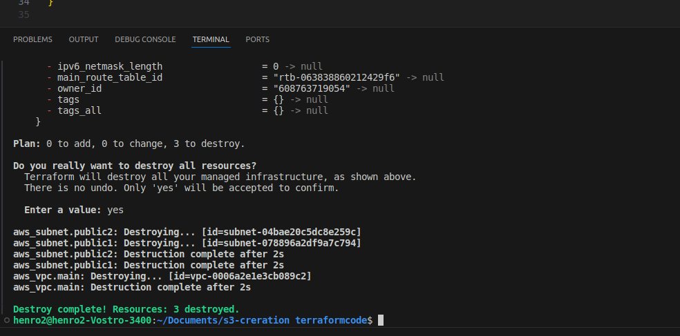

## Automating AWS infrastructure in code (Terraform)

I created **main.tf**  file in my PBL folder to store my terraform code.

   I coppied and pasted the the AWS provider resouce code and changed the region to US-EAST-1

   I also copied the VPC creation resouces and pasted 

   

   ## Subnets resource section

   I also inserted the aws resouce code for creating subnets in my new VPC. Note, I changed the available zone of pblic1 subnet to US-east-1a and Public2 to Us-east-1b. SO we have two avaiblabilty zones. A and B.

   

-  I ran terrafom apply and the VPC and the subnets where created sussessfully as shown below
SS

## Fixing The Problems By Code Refactoring

- Now i have to destroy my corrent infastructure so i can refactor my codes 

**Fixing Hard Coded Values**: We will introduce variables, and remove hard coding.

SO i have to edit     **main.tf** file 

